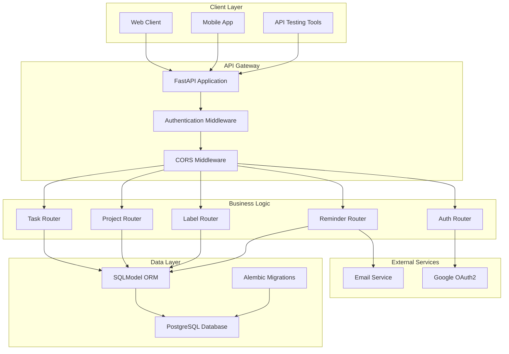
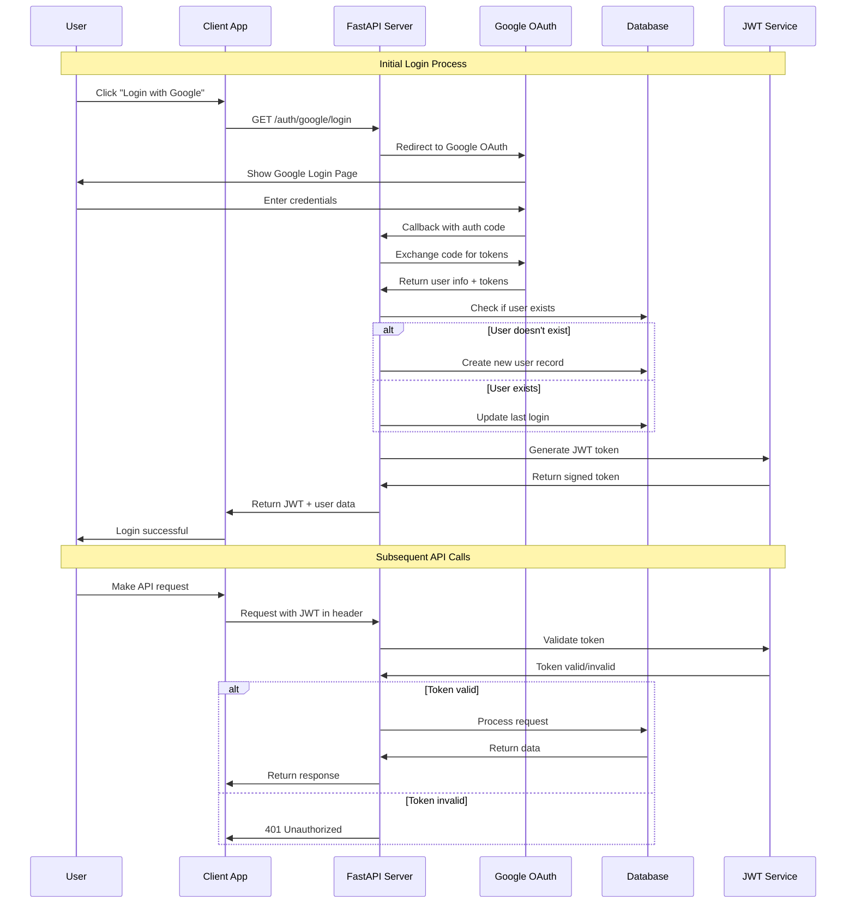
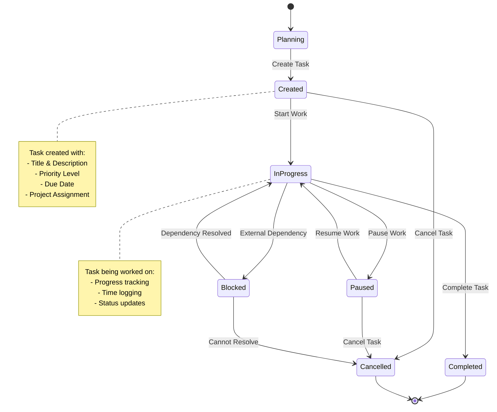
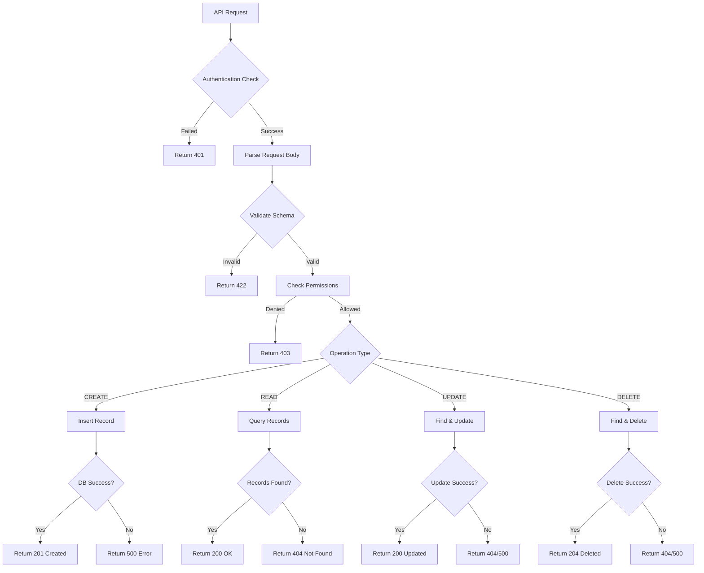
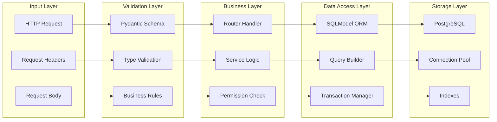
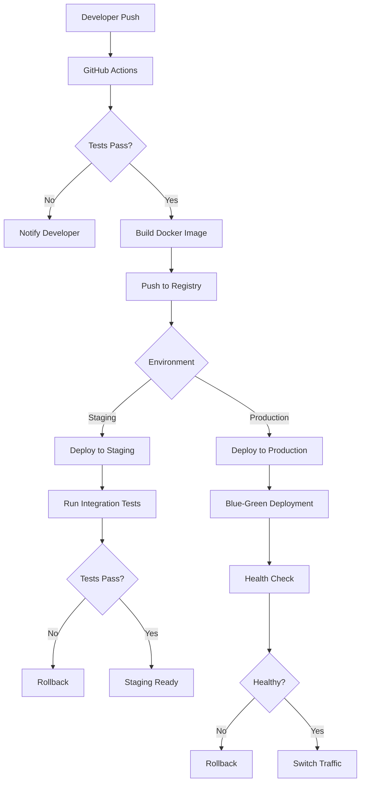
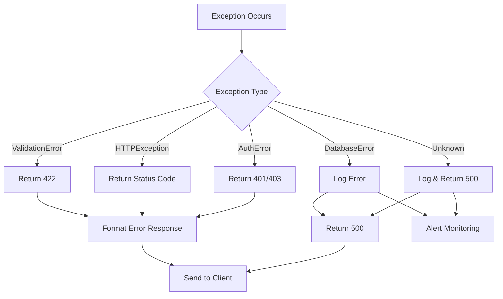
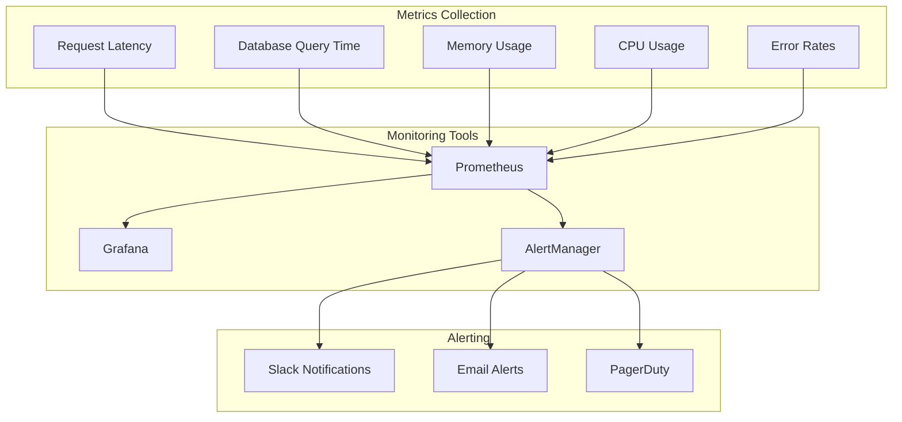
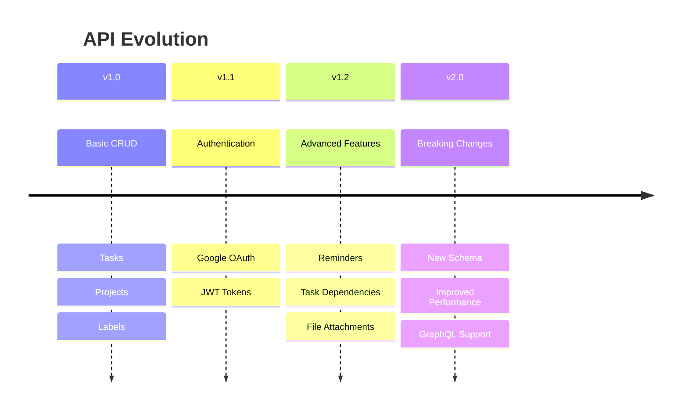

# TaskUp - Technical Workflow Documentation

## 🔄 System Architecture Overview



## 🔐 Authentication Flow Detail



## 📋 Task Management Workflow



## 🏗️ Database Operations Flow



## 🔄 Project Development Lifecycle

```mermaid
gitgraph
    commit id: "Initial Setup"
    commit id: "Database Models"
    commit id: "API Schemas"
    
    branch feature/authentication
    checkout feature/authentication
    commit id: "Google OAuth Setup"
    commit id: "JWT Implementation"
    commit id: "Auth Middleware"
    
    checkout main
    merge feature/authentication
    commit id: "Auth Integration"
    
    branch feature/task-management
    checkout feature/task-management
    commit id: "Task CRUD"
    commit id: "Task-Label Relations"
    commit id: "Task Permissions"
    
    checkout main
    merge feature/task-management
    commit id: "Task System Complete"
    
    branch feature/reminders
    checkout feature/reminders
    commit id: "Reminder Model"
    commit id: "Scheduler Service"
    commit id: "Email Integration"
    
    checkout main
    merge feature/reminders
    commit id: "v1.0 Release"
```

## 📊 Data Flow Architecture



## 🧪 Testing Strategy

```mermaid
pyramid
    title Testing Pyramid
    
    section Unit Tests
        Models
        Schemas
        Utilities
    
    section Integration Tests
        API Endpoints
        Database Operations
        Authentication Flow
    
    section E2E Tests
        Complete User Workflows
        Cross-Service Integration
```

## 🚀 Deployment Pipeline



## 🔧 Error Handling Flow



## 📈 Performance Monitoring



## 🔄 API Versioning Strategy



This documentation provides a comprehensive technical overview for your team members and seniors to understand the project architecture, workflows, and development processes.