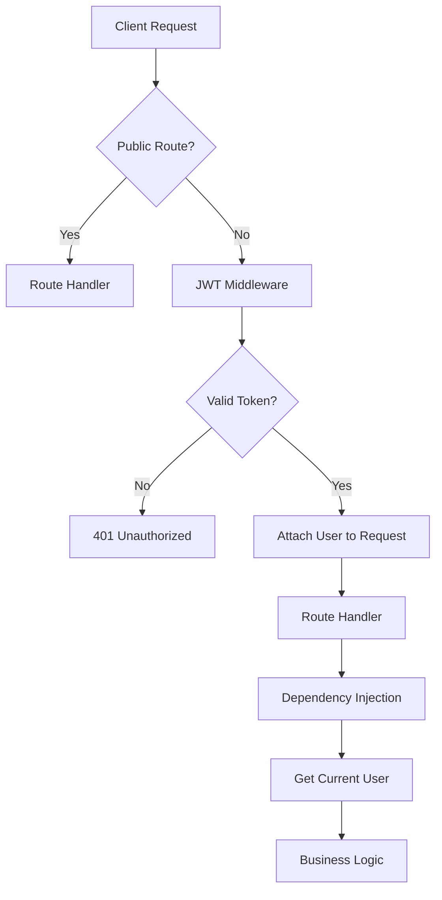
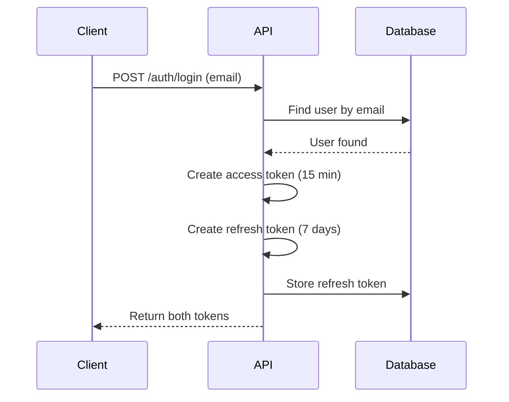
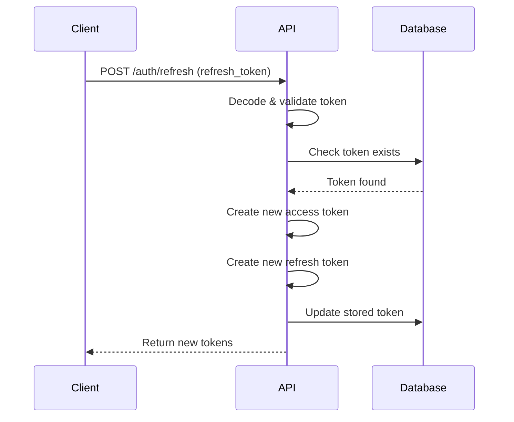
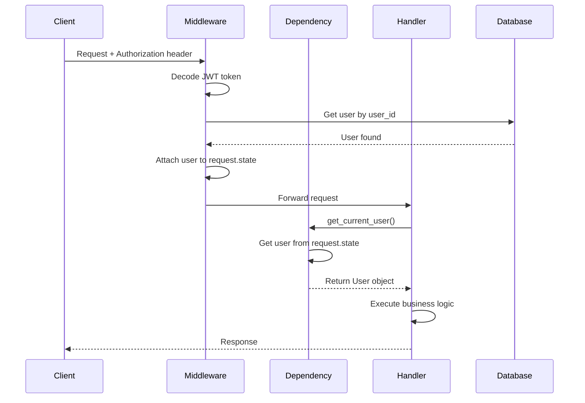

# Authentication System Documentation

## Overview

The TaskUp application uses a JWT-based authentication system with access and refresh tokens. The system includes Google OAuth integration, token refresh capabilities, and global middleware for authentication.

## Architecture



## Components

### 1. Configuration (`auth/config.py`)

Centralized authentication configuration:

```python
ACCESS_TOKEN_EXPIRE_MINUTES = 15
REFRESH_TOKEN_EXPIRE_DAYS = 7
ALGORITHM = "HS256"
SECRET_KEY = "pratyanj"  # Change in production
```

> [!WARNING]
> **Production Security**: Change the `SECRET_KEY` to a secure random value in production. Use environment variables to store sensitive configuration.

### 2. JWT Token Handler (`auth/jwt_handler.py`)

Creates access and refresh tokens with different expiration times.

**Functions:**
- `create_access_token(user_id: int)` - Creates short-lived access token (15 minutes)
- `create_refresh_token(user_id: int)` - Creates long-lived refresh token (7 days)

**Token Payload Structure:**
```json
{
  "user_id": 123,
  "exp": 1234567890,
  "type": "refresh"  // Only in refresh tokens
}
```

### 3. JWT Middleware (`middleware/jwt_middleware.py`)

Global middleware that validates JWT tokens on all protected routes.

**Features:**
- Validates JWT tokens from `Authorization` header
- Attaches authenticated user to `request.state.user`
- Returns 401 for invalid/expired tokens
- Skips authentication for public paths

**Public Paths:**
- `/auth/login`
- `/auth/refresh`
- `/auth/google/login`
- `/auth/google/callback`
- `/docs`
- `/openapi.json`

**Usage in `main.py`:**
```python
from middleware import JWTAuthMiddleware

app.add_middleware(JWTAuthMiddleware)
```

### 4. Dependency Injection (`auth/deps.py`)

Provides type-safe access to the current user in route handlers.

**Function:**
```python
async def get_current_user(request: Request) -> User
```

**How it works:**
1. Retrieves user from `request.state.user` (set by middleware)
2. Raises 401 if user not found
3. Returns authenticated `User` object

**Usage in routes:**
```python
@router.get("/tasks/")
def get_tasks(
    current_user: User = Depends(get_current_user),
    session: Session = Depends(get_session)
):
    return session.exec(select(Task).where(Task.owner_id == current_user.id)).all()
```

### 5. Refresh Token Model (`models/refresh_token.py`)

Database model for storing refresh tokens.

```python
class RefreshToken(SQLModel, table=True):
    id: Optional[int] = Field(default=None, primary_key=True)
    token: str
    user_id: int = Field(foreign_key="user.id")
    created_at: datetime = Field(default_factory=datetime.utcnow)
```

## Authentication Endpoints

### Google OAuth Login

**Endpoint:** `GET /auth/google/login`

Initiates Google OAuth flow.

**Response:** Redirects to Google login page

---

**Endpoint:** `GET /auth/google/callback`

Handles Google OAuth callback.

**Response:**
```json
{
  "access_token": "eyJ0eXAiOiJKV1QiLCJhbGc...",
  "refresh_token": "eyJ0eXAiOiJKV1QiLCJhbGc...",
  "token_type": "bearer",
  "user": {
    "id": 1,
    "email": "user@example.com",
    "name": "John Doe"
  }
}
```

### Email Login

**Endpoint:** `POST /auth/login`

Login with email (finds existing user).

**Request:**
```json
{
  "email": "user@example.com"
}
```

**Response:**
```json
{
  "access_token": "eyJ0eXAiOiJKV1QiLCJhbGc...",
  "refresh_token": "eyJ0eXAiOiJKV1QiLCJhbGc...",
  "token_type": "bearer"
}
```

**Error Responses:**
- `404` - User not found

### Refresh Token

**Endpoint:** `POST /auth/refresh`

Exchanges refresh token for new access and refresh tokens.

**Request:**
```json
{
  "refresh_token": "eyJ0eXAiOiJKV1QiLCJhbGc..."
}
```

**Response:**
```json
{
  "access_token": "eyJ0eXAiOiJKV1QiLCJhbGc...",
  "refresh_token": "eyJ0eXAiOiJKV1QiLCJhbGc..."
}
```

**Features:**
- Validates refresh token type
- Checks token exists in database (not revoked)
- Rotates refresh token (old token invalidated)
- Issues new access and refresh tokens

**Error Responses:**
- `401` - Invalid token type
- `401` - Refresh token revoked
- `401` - Token expired
- `401` - Invalid token

### Logout

**Endpoint:** `POST /auth/logout`

Revokes refresh token.

**Request:**
```json
{
  "refresh_token": "eyJ0eXAiOiJKV1QiLCJhbGc..."
}
```

**Response:**
```json
{
  "message": "Logged out"
}
```

**Note:** Deletes refresh token from database, preventing future token refresh.

## Authentication Flow

### Initial Login Flow



### Token Refresh Flow



### Protected Route Access Flow



## Security Best Practices

### Token Storage (Client-Side)

> [!IMPORTANT]
> **Access Token**: Store in memory (JavaScript variable)
> **Refresh Token**: Store in httpOnly cookie or secure storage

### Token Expiration

- **Access Token**: 15 minutes (short-lived for security)
- **Refresh Token**: 7 days (long-lived for convenience)

### Token Rotation

Refresh tokens are rotated on each refresh request:
1. Old refresh token is invalidated
2. New refresh token is issued
3. Prevents token reuse attacks

### Production Checklist

- [ ] Change `SECRET_KEY` to secure random value
- [ ] Use environment variables for secrets
- [ ] Enable HTTPS (`https_only=True` in SessionMiddleware)
- [ ] Set secure CORS origins
- [ ] Add rate limiting to auth endpoints
- [ ] Implement token blacklisting for logout
- [ ] Add logging for authentication events
- [ ] Consider adding 2FA

## Error Handling

All authentication errors return appropriate HTTP status codes:

| Status Code | Description |
|-------------|-------------|
| `401` | Unauthorized - Invalid/expired token |
| `404` | Not Found - User doesn't exist |
| `500` | Internal Server Error |

## Testing Authentication

### Using cURL

**Login:**
```bash
curl -X POST http://localhost:8000/auth/login \
  -H "Content-Type: application/json" \
  -d '{"email": "user@example.com"}'
```

**Access Protected Route:**
```bash
curl -X GET http://localhost:8000/tasks/ \
  -H "Authorization: Bearer YOUR_ACCESS_TOKEN"
```

**Refresh Token:**
```bash
curl -X POST http://localhost:8000/auth/refresh \
  -H "Content-Type: application/json" \
  -d '{"refresh_token": "YOUR_REFRESH_TOKEN"}'
```

### Using Python Requests

```python
import requests

# Login
response = requests.post(
    "http://localhost:8000/auth/login",
    json={"email": "user@example.com"}
)
tokens = response.json()

# Access protected route
response = requests.get(
    "http://localhost:8000/tasks/",
    headers={"Authorization": f"Bearer {tokens['access_token']}"}
)
tasks = response.json()
```

## Troubleshooting

### "Missing or invalid Authorization header"

**Cause:** No `Authorization` header or wrong format

**Solution:** Include header as `Authorization: Bearer YOUR_TOKEN`

### "Token expired"

**Cause:** Access token expired (15 minutes)

**Solution:** Use refresh token to get new access token

### "Refresh token revoked"

**Cause:** Refresh token not found in database

**Solution:** User needs to login again

### "User not found"

**Cause:** User doesn't exist in database

**Solution:** Ensure user is registered before login
